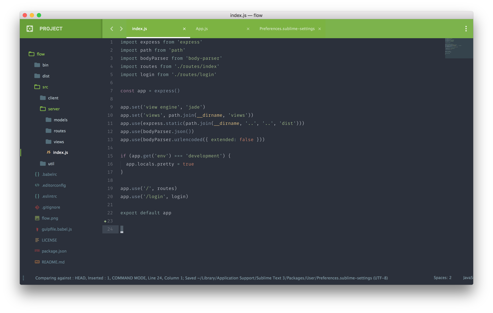
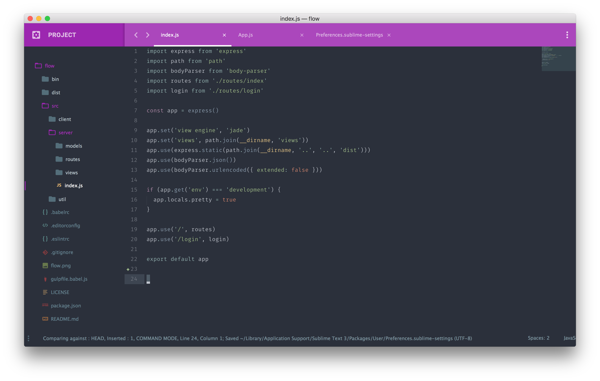
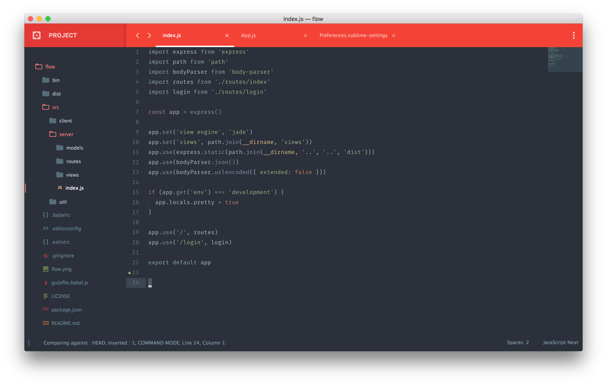
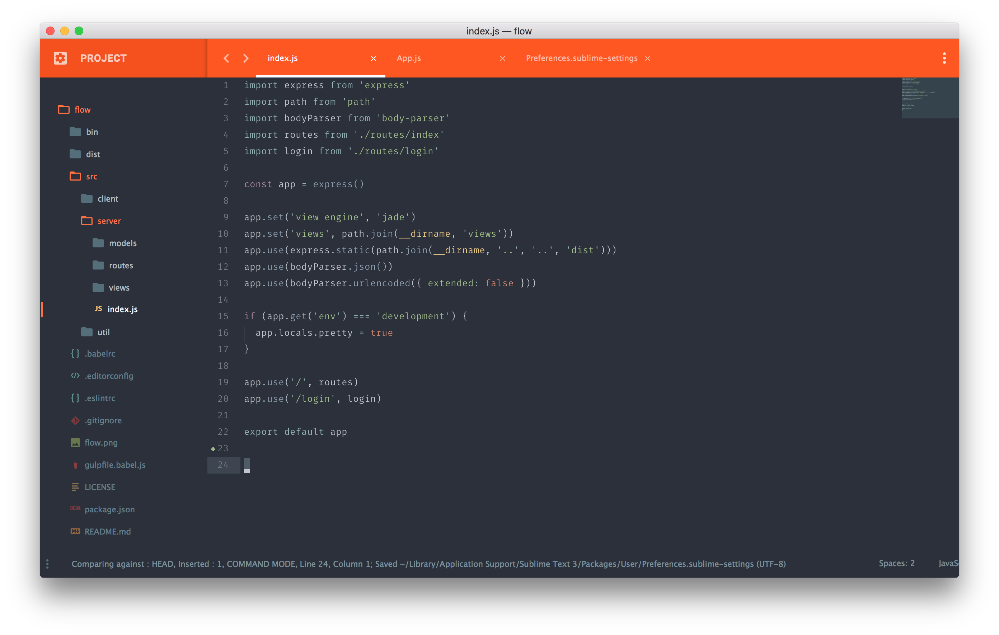
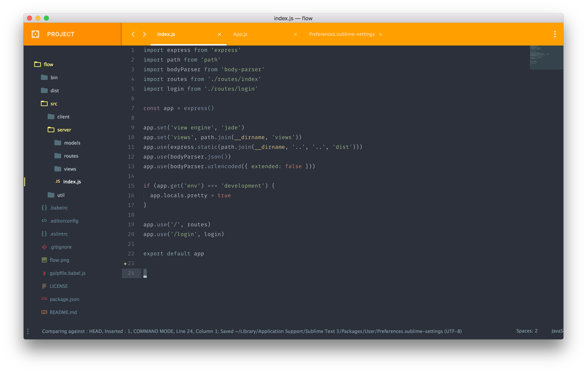

# Materialize - Appbar

With this add-on you can add a tinted app bar to any theme from [Materialize](https://github.com/saadq/Materialize). This add-on auto fits with material theme accent colors!

## Screenshots
> All screenshots are using Material Spacegray as the theme and color scheme and are using the Fira Mono font.

### Default


### Lime Accent
> `"material_theme_accent_lime": true`


### Indigo Accent
> `"material_theme_accent_indigo": true`


### Purple Accent
> `"material_theme_accent_purple": true`


### Red Accent
> `"material_theme_accent_red": true`


### Orange Accent
> `"material_theme_accent_orange": true`


### Yellow Accent
> `"material_theme_accent_yellow": true`


## Easy installation

The easiest way to install this package is through [Package Control](https://packagecontrol.io/installation). Just search for "Materialize Appbar" and hit enter. Once installed, restart your editor.

## Manual installation

1. Download the [latest release](https://github.com/saadq/Materialize-appbar/releases/latest), extract and rename the folder to **"Materialize - Appbar"**.

2. Move the folder inside your sublime Packages directory. **(Preferences > Browse packages...)** then restart Sublime Text

## Add-on options

```json
"material_theme_tree_headings": true  // Show sidebar headings
```

